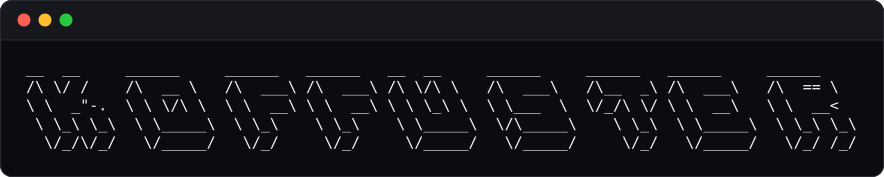

# Koffuster

> Enumeração ativa de terminal, escrita em KOF — um binário, seis modos, zero exploração.



Koffuster é uma ferramenta de enumeração ativa para terminal, escrita em KOF
(Kof4j), voltada ao runtime **0.5.0-beta**. Ela reúne em um único binário os
modos mais comuns de reconhecimento:

| Modo | O que faz |
|---|---|
| `dir` | força bruta de diretórios/arquivos |
| `dns` | enumeração de subdomínios via DNS-over-HTTPS |
| `vhost` | enumeração de virtual hosts (novo nesta versão!) |
| `fuzz` | substituição de payloads com `FUZZ` em URL/cabeçalho/corpo |
| `s3` / `gcs` | verificação de existência/permissão de buckets S3 e GCS |
| `tftp` | checagem de existência de arquivos via TFTP (RRQ, somente leitura) |

Todo achado é reportado como **achado de enumeração**, nunca como
vulnerabilidade — Koffuster não explora nada, apenas sonda e reporta.

> **Primeira vez aqui?** Vá direto para
> [Instalação (passo a passo)](#instalação-passo-a-passo) — um guia de zero,
> sem assumir nada além de um terminal Linux.

---

## O que mudou para o KOF 0.5.0-beta (v0.2.0)

A versão 0.2.0 foi reescrita para o runtime **KOF 0.5.0-beta** e aproveita o
que essa build corrigiu em relação à 0.2.6-beta:

- **`spawn` dinâmico com argumentos**: o 0.5.0 permite `spawn f(x)` e
  `listOf<Handle<T>>()`, então o motor de concorrência (que era ~1200 linhas
  de slots desenrolados à mão) virou um punhado de funções genéricas. O
  `sched.kf` atual tem ~150 linhas.
- **Status exato para qualquer resposta**: `http.status()` não lança mais por
  código de status — 200, 404, 403, 500... todos são reportados com precisão.
- **`http.get` com headers não lança em 4xx**: o corpo de uma resposta
  404/403 agora é lido normalmente, então o tamanho real aparece em
  candidatos que antes mostravam `-` (sentinela).
- **Erros de rede classificados por exceção `Exception`** (o catch `String e`
  do 0.2.6 não existe mais).
- **Modo `vhost` implementado de verdade** — na versão 0.1.0 o modo estava
  registrado no help e no dispatch, mas o arquivo do driver não existia; ele
  agora funciona.

E a CLI foi **simplificada**:

- `--threads` aceita **qualquer número** (antes era arredondado para
  1/2/4/8/16 por limitação do compilador).
- Removidas opções sem efeito real: `-k/--insecure`, `--no-banner`,
  `--delay`, `--rate`, `--wildcard-tests`.
- Atalho novo: `-f` para `--format`.
- Helps por modo reescritos em português, diretos e com exemplos.

---

## Requisitos e dependências

- Um runtime **KOF 0.5.0-beta** instalado — o download oficial fica em
  **[https://koflang.github.io/](https://koflang.github.io/)**. O launcher
  encontra o runtime como `kof` no `PATH` ou via `$KOF_HOME/bin/kof` (veja
  [Como o launcher encontra o runtime](#como-o-launcher-encontra-o-runtime)).
  A distribuição é autocontida: traz a própria JVM embutida, então **nenhuma
  instalação de Java é necessária**.
- **Koffuster não é um executável independente.** Ele é código-fonte KOF
  (`src/*.kf`) que o runtime `kof` compila e executa a cada chamada, através
  do launcher `bin/koffuster`. Não existe binário nativo separado.
- O ambiente-alvo é **Linux com `bash`**; macOS e Windows (via WSL) ainda
  não são testados.

---

## Instalação (passo a passo)

Nunca usou o Koffuster? São três passos, uns cinco minutos. Você só precisa
de um terminal Linux com `bash` — o Java, o compilador e o runtime vêm
embutidos no KOF.

### Passo 1 — Instale o runtime KOF

O Koffuster é feito de código KOF (`src/*.kf`): quem compila e executa é o
runtime **KOF 0.5.0-beta**. Baixe a distribuição oficial em
**[https://koflang.github.io/](https://koflang.github.io/)** (página de
download do site, ou as
[releases no GitHub](https://github.com/KofLang/Kof4j/releases)) e siga o
instalador. A instalação é autocontida — nada de Java, Maven ou dependências
extras. Confirme o resultado:

```bash
kof version
# kof 0.5.0-beta
```

Se o comando não responder, o `kof` ainda não está no `PATH` — veja
[Como o launcher encontra o runtime](#como-o-launcher-encontra-o-runtime).

### Passo 2 — Baixe o Koffuster

O projeto fica em
**[https://github.com/lunalully/koffuster](https://github.com/lunalully/koffuster)**.
Com `git` instalado:

```bash
git clone https://github.com/lunalully/koffuster.git
cd koffuster
```

Sem `git`? Na página do repositório, clique em **Code → Download ZIP**,
extraia a pasta e entre nela pelo terminal. Valide a cópia (ainda sem
instalar nada):

```bash
./bin/koffuster --version
# koffuster 0.2.0
```

### Passo 3 — Chame `koffuster` de qualquer pasta (recomendado)

Até aqui, `./bin/koffuster` só funciona de dentro da pasta do projeto. Para
digitar apenas `koffuster` em qualquer terminal — como nos exemplos deste
README — crie um atalho (symlink) em `~/.local/bin`, a pasta padrão de
programas do usuário. **Rode os comandos de dentro da pasta do clone:**

```bash
mkdir -p ~/.local/bin
ln -sf "$PWD/bin/koffuster" ~/.local/bin/koffuster
```

O `$PWD` vira o caminho completo do launcher; se o projeto ficou em outro
lugar, troque por
`ln -sf /caminho/para/koffuster/bin/koffuster ~/.local/bin/koffuster`.
Confirme:

```bash
command -v koffuster   # deve mostrar ~/.local/bin/koffuster
koffuster --version    # koffuster 0.2.0
```

Se o `command -v` não mostrar nada, seu `~/.local/bin` ainda não está no
`PATH`. Adicione uma vez, no arquivo do seu shell:

```bash
# bash:
echo 'export PATH="$HOME/.local/bin:$PATH"' >> ~/.bashrc && source ~/.bashrc

# zsh:
echo 'export PATH="$HOME/.local/bin:$PATH"' >> ~/.zshrc && source ~/.zshrc
```

Detalhes que valem saber:

- O atalho aponta para a pasta do clone: se você mover ou apagar o projeto,
  recrie o symlink. Para remover: `rm ~/.local/bin/koffuster`.
- Sem atalho também funciona: como o launcher resolve o próprio caminho,
  `~/koffuster/bin/koffuster --version` roda de qualquer pasta — digitar
  `koffuster` é só conveniência.

### Primeiro uso

Estes dois comandos não tocam em nenhum alvo e mostram tudo o que existe:

```bash
koffuster --help          # modos e sintaxe
koffuster help dir        # ajuda detalhada de um modo
```

Todo modo ativo pede uma wordlist. Para um primeiro teste de verdade, sem
sair da sua máquina (requer `python3`), o projeto inclui um servidor de teste
local:

```bash
python3 labs/http_lab.py >/dev/null 2>&1 &   # alvo de teste em 127.0.0.1:18080
printf 'admin\nlogin\n200-teste\n' > palavras.txt
koffuster dir http://127.0.0.1:18080 palavras.txt
kill %1                                       # encerra o servidor de teste
```

> Use o Koffuster somente em alvos para os quais você tem autorização.

### Como o launcher encontra o runtime

Ordem de escolha: `$KOFFUSTER_KOF_JAR` (jar staged, para testes) →
`$KOF_HOME/bin/kof` → `kof` no `PATH`.

O launcher (`bin/koffuster`):

1. Resolve o próprio caminho real (funciona via symlink e de qualquer
   diretório de trabalho) e localiza `src/` e `banner.txt`.
2. Exporta a flag JVM do vhost, mesclando com o que o chamador já tiver.
3. Se `--proxy <url>` for passado, mapeia para as propriedades
   `http(s).proxyHost`/`http(s).proxyPort` da JVM.
4. Limpa o stderr do processo filho: remove as linhas "Picked up
   JDK_JAVA_OPTIONS ..." e o prefixo de timestamp+nível que o `log.error` do
   runtime adiciona. O stdout nunca é tocado.
5. Executa (`exec`) o runtime KOF apontando para `src/main.kf`, repassando
   todos os argumentos exatamente como recebidos.

**Funciona a partir de qualquer diretório.** Caminhos relativos em
`-w/--wordlist` e `-o/--output` são resolvidos contra o diretório onde você
chamou `koffuster`, não contra a raiz do projeto.

O launcher exporta automaticamente a cada execução:

```
JDK_JAVA_OPTIONS="-Djdk.httpclient.allowRestrictedHeaders=host"
```

Essa flag é obrigatória para o modo `vhost` (o runtime precisa sobrescrever
o header `Host`, que a JVM normalmente proíbe o cliente de alterar).

---

## Como executar

```
koffuster <modo> <alvo> <wordlist> [opções]
koffuster <modo> -u/-d <alvo> -w <wordlist> [opções]   # forma clássica
koffuster --help | -h
koffuster --version
koffuster help <modo>
koffuster <modo> --help
```

Na forma curta, os posicionais preenchem os campos vazios na ordem do modo:
`dir`/`vhost` → `<url> <wordlist>`; `dns` → `<domínio> <wordlist>`;
`fuzz` → `<url-com-FUZZ> <wordlist>`; `s3`/`gcs` → `<wordlist>`;
`tftp` → `<servidor[:porta]> <wordlist>`. Em `dir`/`vhost`/`fuzz`, uma url sem
esquema vira `https://` (para `http://`, digite o esquema). Os atalhos
`-u/--url`, `-d/--domain` e `-w/--wordlist` continuam aceitos e podem ser
misturados com posicionais.

Modos: `dir dns vhost fuzz s3 gcs tftp`.

### Um exemplo real por modo

```bash
# dir — força bruta de diretórios/arquivos
koffuster dir alvo.com.br wordlist.txt -x php,html -t 16 -s 200,301

# dns — subdomínios via DNS-over-HTTPS
koffuster dns exemplo.com subdominios.txt --resolver https://dns.google/resolve

# vhost — virtual hosts variando o cabeçalho Host
koffuster vhost http://10.0.0.5/ hosts.txt --domain exemplo.com

# fuzz — substituição de FUZZ na URL, cabeçalho ou corpo
koffuster fuzz "alvo.com/busca?q=FUZZ" payloads.txt -s 200

# s3 — existência/permissão de bucket S3 (somente leitura)
koffuster s3 buckets.txt

# gcs — mesma ideia, endpoint do Google Cloud Storage
koffuster gcs buckets.txt --endpoint "https://storage.googleapis.com/%s/"

# tftp — checagem de existência de arquivos (RRQ, somente leitura)
koffuster tftp 10.0.0.9:69 arquivos.txt -v
```

Todo exemplo acima é aceito literalmente pelo parser — não são pseudo-código.

### Códigos de saída

| Código | Significado |
|---|---|
| `0` | Execução ok, inclusive uma execução limpa que simplesmente não achou nada |
| `1` | A execução terminou com zero resultados **e** pelo menos um erro operacional (toda requisição recusada/expirou, alvo inalcançável) |
| `2` | Erro de uso: opção desconhecida ou opção obrigatória faltando |

---

## Opções

### Comuns a todos os modos ativos (dir/dns/vhost/fuzz/s3/gcs)

Na forma curta (posicional), `<alvo>` e `<wordlist>` vêm direto na linha de
comando; as flags abaixo continuam equivalentes.

| Opção | Significado | Padrão |
|---|---|---|
| `-w, --wordlist <arquivo\|->` | wordlist, ou `-` para stdin | obrigatório |
| `-t, --threads <n>` | concorrência (qualquer número ≥ 1) | 8 |
| `--timeout <seg>` | timeout por requisição | 10 |
| `-o, --output <arquivo>` | grava resultados também em arquivo (append+flush) | só stdout |
| `-f, --format <text\|jsonl>` | formato de saída | text |
| `--proxy <url>` | proxy HTTP, mapeado pelo launcher para a JVM | — |
| `-q, --quiet`, `-silent/--silent` | sem banner/progresso/resumo, só resultados | off |
| `--color` | força cores ANSI (padrão: desligadas) | off |
| `-v, --verbose` | ecoa a configuração efetiva (segredos redigidos) no stderr | off |

### Autenticação e headers (dir/vhost/fuzz)

| Opção | Significado |
|---|---|
| `-H, --header <'Chave: Valor'>` | header extra, repetível |
| `--cookie <c>` | cookie (redigido no `-v`) |
| `--auth <user:pass>` | HTTP Basic Auth (redigido no `-v`) |
| `-a, --user-agent <ua>` | User-Agent (padrão `koffuster/0.2`) |

### Específicas por modo

- **dir**: `-u/--url <base>` (obrigatório), `-x/--extensions <csv>`,
  `-s/--status <lista>`, `-b/--exclude-status <lista>` (padrão `404`),
  `--exclude-length <lista>` (valores e faixas, ex. `0,100-200`).
- **dns**: `-d/--domain <domínio>` (obrigatório), `--resolver <url-DoH>`
  (padrão `https://dns.google/resolve`). Não aceita os filtros HTTP de `dir`
  (não fazem sentido para DNS).
- **vhost**: `-u/--url <alvo>` (obrigatório), `-d/--domain <domínio>`
  (faz o Host virar `palavra.domínio`).
- **fuzz**: `-u/--url` (obrigatório, com `FUZZ`), `-X/--method` (GET/POST/
  PUT/DELETE), `--body <dados>`, `-s/--status`, `-b/--exclude-status`,
  `--exclude-length`.
- **s3/gcs**: `--endpoint <modelo>` (`%s` vira o nome do bucket).
- **tftp**: `--server`/`-u` (servidor, `host[:porta]`) e `--port` (quando a
  porta não vem no host). RRQ modo `octet` por candidato; nada é escrito.

Filtros do dir/fuzz: `-s/--status` (se dado) desliga a exclusão padrão de
404; `-b/--exclude-status` aplica depois; `--exclude-length` por último.

---

## Formatos de saída

- **Resultados sempre vão para stdout — e só no final.** Durante a varredura
  o terminal mostra banner/progresso (em stderr); a lista completa sai de
  uma vez quando o scan chega a 100%, com um pequeno settle de 200 ms entre
  a barra e a lista (sem ele, o stdout alcança o terminal antes do stderr e
  o 100% aparece no meio dos resultados). Banner, progresso e resumo final
  vão para stderr — `koffuster dir ... 2>/dev/null` numa pipeline só entrega
  as linhas de resultado.
- **Texto** (padrão): colunas alinhadas, ex. `200   1234    /admin`.
- **JSONL** (`-f jsonl`): uma linha JSON por resultado no stdout, sem
  banner/cores/progresso misturados — cada linha é `json.loads`-ável
  isoladamente.
- **Cores**: desligadas por padrão (sem detecção confiável de TTY na build
  do KOF). `--color` força ligar; `NO_COLOR`, `-q` e `-f jsonl` forçam
  desligar.
- **`-o/--output <arquivo>`**: cada resultado é gravado no arquivo (append)
  e imediatamente `flush`ado assim que é produzido — ao contrário do
  terminal (que só mostra a lista no final), o arquivo acompanha o scan em
  tempo real e sobrevive a um `Ctrl+C` no meio da execução.

---

## Banner

O banner é a arte ASCII mantida em `banner.txt`, na raiz do projeto (hoje
"KOFFUSTER" no font Sub-Zero). O launcher exporta `KOFFUSTER_BANNER`
apontando para esse arquivo, então a arte aparece rodando de qualquer
diretório — não é preciso colar arte no código. Se o arquivo estiver vazio
ou não existir, Koffuster imprime apenas a palavra `Koffuster`. Para trocar
a arte, substitua `banner.txt` preservando os bytes como fornecidos (a
variável `KOFFUSTER_BANNER` também pode apontar para outro arquivo). A
prévia no topo deste README (`assets/banner.svg`) é gerada a partir do
`banner.txt`.

---

## Solução de problemas

- **"Picked up JDK_JAVA_OPTIONS..." no stderr**: já filtrado pelo launcher.
  Se você rodar o runtime KOF diretamente, essas linhas voltam — é a JVM
  avisando, não um erro do Koffuster.
- **A varredura parece travada**: de 50 candidatos em diante, cada modo
  ativo imprime uma barra de progresso de 0 a 100% no stderr (a cada faixa
  de 5%, com o placar de resultados). `-q`/`-silent` desligam. Os corpos dos
  candidatos são buscados em paralelo, na mesma concorrência de `-t`.
- **"0 results" num alvo que responde igual para qualquer path**: é
  soft-404/catch-all (comum em SPA) e o modo `dir` avisa no stderr; os
  candidatos idênticos ao baseline são filtrados por design — use
  `-s <status>` (ex.: `-s 200`) para vê-los.
- **Timeouts (`timeout` nos resultados)**: aumente `--timeout` se o alvo for
  lento, ou reduza `-t/--threads` para não saturar rede/alvo.
- **Conexão recusada (`refused`)**: porta fechada ou alvo fora do ar;
  Koffuster nunca trava, reporta o erro e segue (contabilizado no resumo).
- **Wordlist grande consumindo muita memória**: não existe API de leitura em
  streaming nesta build do KOF — o arquivo inteiro (ou todo o stdin) é
  carregado de uma vez. Para wordlists enormes, divida em partes menores.

---

## Limitações conhecidas

- **`tftp` é enumeração read-only, não transferência.** O modo envia um
  RRQ (modo `octet`) por candidato e classifica a resposta: DATA (existe;
  o ACK do bloco 1 é enviado para o servidor parar de retransmitir),
  ERROR 2 (existe, acesso negado), ERROR 1 (não existe; omitido por
  padrão) e timeout (omitido por padrão; conta como erro). O tamanho
  exibido é o do primeiro bloco de dados (tipicamente ≤ 512 bytes), não o
  tamanho total do arquivo — nada além do primeiro bloco é baixado.
  O probe usa interop JVM (`java.net`), então o modo roda no target JVM
  (o padrão do launcher); IPv6 não é suportado (o último `:` define a
  porta).
- **Status exato com headers custom só para 5xx.** `http.status()` não
  aceita headers nesta build, e `http.get(url, headers)` retorna apenas o
  corpo (sem o código) para 2xx-4xx; só 5xx aparece na exceção (`HTTP 5xx`).
  Consequência: em `vhost` (que sempre usa Host custom) e em `dir`/`fuzz`
  com `-H`/`--cookie`/`--auth`, um candidato 2xx-4xx é reportado com status
  `200` e o tamanho real do corpo, e 5xx com o status verdadeiro. No modo
  `dir` sem headers custom (o caminho mais comum), o status é sempre exato.
- **Sem leitura de cabeçalhos de resposta.** O runtime KOF não expõe API
  para ler cabeçalhos da resposta HTTP: não há como seguir redirecionamentos
  (o destino de um `3xx` não pode ser lido, então `--follow-redirects` não
  existe) e o "tamanho" é sempre `.length()` do corpo já baixado.
- **Cores desligadas por padrão.** Sem detecção confiável de TTY nesta
  build, Koffuster nunca adivinha — cores só com `--color` explícito, para
  manter pipelines (`| grep`, `| jq`) sempre limpas.
- **Sem captura de `Ctrl+C` no código**, mas isso não perde resultado:
  cada linha em `-o/--output` é gravada com append+flush imediatamente, então
  o que já foi encontrado permanece no arquivo mesmo se o processo morrer sem
  resumo final.

---

## Estrutura do projeto

```
koffuster/
├── bin/koffuster        # launcher bash (resolve o runtime KOF e executa o módulo)
├── src/                 # código-fonte KOF (compila como um único módulo)
│   ├── main.kf          # dispatch de modos, --version, help top
│   ├── cli.kf           # parser de argumentos + textos de ajuda
│   ├── sched.kf         # concorrência com spawn dinâmico (KOF 0.5.0)
│   ├── classify.kf      # baseline soft-404, filtros, helpers DoH
│   ├── httpx.kf         # headers e classificação de erro HTTP
│   ├── output.kf        # formatação text/JSONL, banner, progresso, resumo
│   ├── wordlist.kf      # leitura de wordlist + expansão de extensões
│   ├── util_str.kf      # percent-encoding, base64, ranges, redação
│   ├── modes_dir.kf     # dir
│   ├── modes_dns.kf     # dns
│   ├── modes_vhost.kf   # vhost
│   ├── modes_fuzz.kf    # fuzz
│   ├── modes_store.kf   # s3/gcs
│   └── modes_tftp.kf    # tftp (RRQ read-only, interop JVM)
├── docs/                # documentação técnica (arquitetura, relatórios)
├── labs/                # laboratórios locais de teste (HTTP/UDP/TFTP/DoH)
├── assets/              # imagens do README (banner.svg em moldura de terminal)
├── banner.txt           # arte ASCII do banner (KOFFUSTER no font Sub-Zero)
├── LICENSE              # texto completo da GPLv3
└── README.md
```

---

## Licença

O Koffuster é software livre, licenciado sob a **GNU GPLv3** — o texto
completo está em [LICENSE](LICENSE). Copyright (C) 2026 lunalully.

Na prática: qualquer pessoa pode usar, estudar, modificar e redistribuir o
Koffuster; mas quem distribuir uma versão modificada **precisa manter a
mesma licença e os avisos de autoria** — ninguém pode fechar o código nem
remover os créditos. O runtime KOF também é GPLv3; o Koffuster é um programa
independente e adota a mesma licença.